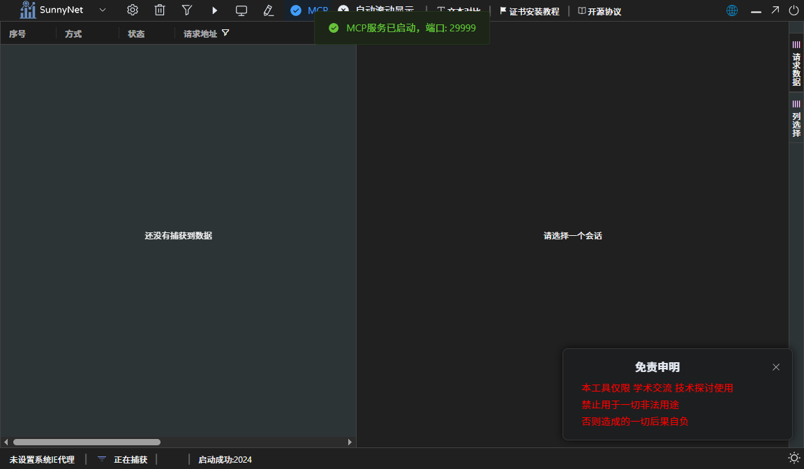

# SunnyNet MCP Server

<div align="center">


**SunnyNet 网络抓包工具的 MCP Server 实现**

支持通过 Model Context Protocol (MCP) 在 AI 应用中使用 SunnyNet 网络分析功能

[快速开始](#快速开始) • [功能说明](#功能说明) • [配置方法](#配置方法) • [使用示例](#使用示例)

</div>

---

## 界面预览

<div align="center">

</div>

## 什么是 MCP Server

MCP (Model Context Protocol) 是 Anthropic 开发的协议，允许 AI 应用（如 Claude Desktop、Cursor 等）通过标准化接口调用外部工具和服务。

SunnyNet MCP Server 将强大的网络抓包功能集成到 AI 工作流中，让您可以通过对话的方式进行网络分析。

## 功能说明

### 核心功能

- [成功] **HTTP/HTTPS 抓包**：捕获和分析 HTTP/HTTPS 请求和响应
- [成功] **WebSocket 支持**：支持 WS/WSS 协议分析
- [成功] **TCP/UDP 抓包**：支持底层网络协议分析
- [成功] **数据解码**：自动解码 gzip、deflate、br、zstd 等压缩格式
- [成功] **进程过滤**：按进程名称过滤网络流量
- [成功] **证书管理**：自动管理 HTTPS 抓包证书
- [成功] **MCP 集成**：完整的 MCP 协议支持，可在 Cursor、Claude Desktop 等 AI 应用中使用

## 快速开始

### 方式一：使用预编译版本（推荐）

1. 下载预编译版本：
   - 位置：`build/bin/SunnyNet.exe`（Windows）
   - 或从 Releases 页面下载

2. 直接运行可执行文件启动 MCP Server

### 方式二：从源码编译

```bash
# 克隆仓库
git clone https://github.com/a121400/sunnymcptool.git
cd sunnymcptool

# 编译 MCP Server
go build -o sunnynet-mcp.exe mcp_server.go mcp_tools.go mcp_stdio.go

# 运行
./sunnynet-mcp.exe
```

## 配置方法

### 在 Cursor 中配置

1. 打开 Cursor 设置
2. 找到 MCP Servers 配置
3. 添加 SunnyNet MCP Server：

```json
{
  "mcpServers": {
    "sunnynet": {
      "command": "C:\\path\\to\\build\\bin\\SunnyNet.exe",
      "args": [],
      "env": {}
    }
  }
}
```

### 在 Claude Desktop 中配置

编辑 `%APPDATA%\Claude\claude_desktop_config.json`：

```json
{
  "mcpServers": {
    "sunnynet": {
      "command": "C:\\path\\to\\build\\bin\\SunnyNet.exe",
      "args": []
    }
  }
}
```

### 配置说明

- **command**: MCP Server 可执行文件的完整路径
- **args**: 启动参数（可选）
- **env**: 环境变量（可选）

## 使用示例

配置完成后，在 Cursor 或 Claude Desktop 中可以通过对话使用 SunnyNet 的功能：

### 示例 1：开始抓包

```
"启动 SunnyNet 抓包，监听端口 8888"
```

AI 将调用 MCP Server 启动抓包服务。

### 示例 2：查看请求

```
"显示最近捕获的 HTTP 请求"
```

AI 将返回最近的网络请求列表。

### 示例 3：分析特定请求

```
"分析请求 ID 为 12345 的详细信息"
```

AI 将显示该请求的完整头信息、响应内容等。

### 示例 4：过滤进程

```
"只抓取 chrome.exe 进程的网络流量"
```

AI 将配置进程过滤规则。

## 可用的 MCP Tools

SunnyNet MCP Server 提供以下工具：

- `start_capture` - 启动网络抓包
- `stop_capture` - 停止抓包
- `list_requests` - 列出捕获的请求
- `get_request_detail` - 获取请求详情
- `set_process_filter` - 设置进程过滤
- `install_certificate` - 安装 HTTPS 证书
- `get_statistics` - 获取抓包统计信息

## 项目结构

```
sunnymcptool/
├── build/
│   └── bin/
│       └── SunnyNet.exe    # 预编译的 MCP Server（推荐使用）
├── mcp_server.go           # MCP Server 主程序
├── mcp_tools.go            # MCP 工具实现
├── mcp_stdio.go            # MCP 标准输入输出处理
├── mcp_standalone/         # 独立 MCP Server 版本
├── SunnyNet/               # SunnyNet 核心库
└── README.md               # 本文档
```

## 技术支持

- **QQ 交流群**: 277869228
- **Issues**: [GitHub Issues](https://github.com/a121400/sunnymcptool/issues)

## 许可证

本项目采用 MIT 许可证 - 详见 [LICENSE](LICENSE) 文件

## 致谢

- [SunnyNet](https://github.com/qtgolang/SunnyNet) - 网络中间件核心库
- [Model Context Protocol](https://modelcontextprotocol.io/) - MCP 协议

---

<div align="center">
如果这个项目对您有帮助，请给一个 ⭐ Star 支持一下！
</div>

