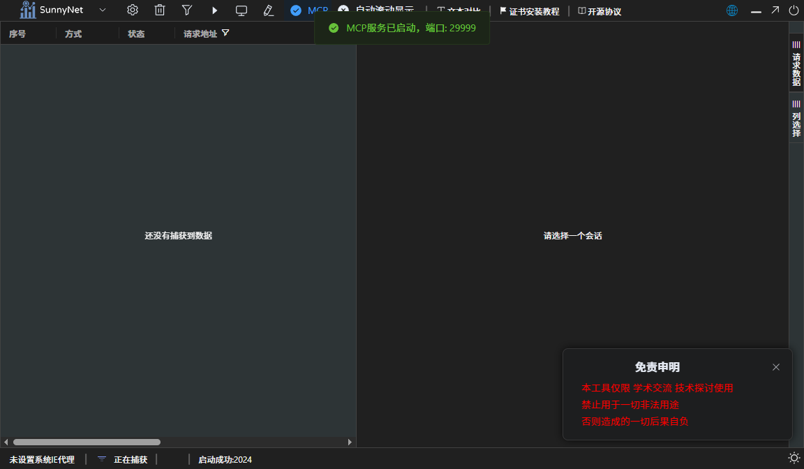

# SunnyNet MCP Server

基于 [SunnyNet](https://github.com/qtgolang/SunnyNet) 网络中间件的 MCP Server，让 AI 直接控制网络抓包、修改请求/响应、管理断点等。



## 下载

从 [Releases](https://github.com/a121400/sunnymcptool/releases) 下载：

| 平台 | GUI 主程序 | MCP 桥接 |
|------|-----------|----------|
| Windows | `SunnyNet.exe` | `sunnynet-mcp.exe` |
| macOS (Apple Silicon) | `SunnyNet.app` | `sunnynet-mcp` |

## 使用方法

### 1. 启动 GUI

运行 `SunnyNet.exe`（Windows）或 `SunnyNet.app`（macOS），GUI 启动后自动开启 MCP HTTP 端点（默认端口 29999）。

### 2. 配置 Cursor / Claude Desktop

在 `.cursor/mcp.json` 或对应配置文件中添加：

```json
{
  "mcpServers": {
    "sunnynet": {
      "command": "/path/to/sunnynet-mcp",
      "args": ["-port", "29999"]
    }
  }
}
```

> `sunnynet-mcp` 是轻量级 stdio→HTTP 桥接程序，将 Cursor 的 JSON-RPC 请求转发到 GUI 的 MCP 端点。

### 3. 对话使用

在 Cursor 中直接：
- "启动抓包"
- "显示最近的请求"
- "搜索包含 login 的请求"
- "查看请求 123 的详情"
- "添加断点拦截 api.example.com"
- "修改响应体"

## 架构

```
Cursor ──stdio──> sunnynet-mcp ──HTTP──> SunnyNet GUI (:29999/mcp)
                                              │
                                         代理端口 (:2024)
                                              │
                                    浏览器/手机/App 流量
```

- **GUI 主程序**：Wails 桌面应用，包含完整 SunnyNet 引擎 + MCP HTTP Server + 可视化界面
- **MCP 桥接**：纯 Go 程序（~8MB），处理 MCP 协议握手，转发工具调用到 GUI
- **tshark 后端**：集成 Wireshark tshark 实现网卡级原始抓包和协议解析（需单独放置 `wireshark/` 目录）

## MCP 工具列表

| 分类 | 工具 | 说明 |
|------|------|------|
| **代理控制** | `proxy_start` / `proxy_stop` | 启动/停止代理 |
| | `proxy_set_port` | 设置代理端口 |
| | `proxy_get_status` | 获取运行状态 |
| | `proxy_set_ie` / `proxy_unset_ie` | 设置/取消系统代理 |
| | `proxy_pause_capture` / `proxy_resume_capture` | 暂停/恢复捕获 |
| **请求** | `request_list` | 获取请求列表（分页） |
| | `request_get` | 获取请求详情 |
| | `request_search` | 按 URL/方法/状态码搜索 |
| | `request_body_search` | 在 Body 中搜索关键词 |
| | `request_get_response_body_decoded` | 获取解码后的响应体 |
| | `request_modify_header` / `request_modify_body` | 修改请求头/体 |
| | `response_modify_header` / `response_modify_body` | 修改响应头/体 |
| | `request_block` | 阻断请求 |
| | `request_release_all` | 放行所有拦截的请求 |
| | `request_resend` | 重发请求 |

| | `request_stats` | 抓包统计 |
| | `request_save_all` / `request_import` | 保存/导入抓包数据（.syn 格式） |
| | `request_highlight_search` / `request_highlight_clear` | UI 高亮搜索 |
| **长连接** | `connection_list` | 列出 WS/TCP/UDP 连接 |
| | `socket_data_list` / `socket_data_get` / `socket_data_get_range` | 数据包操作 |
| **断点** | `breakpoint_add` / `breakpoint_list` / `breakpoint_remove` / `breakpoint_clear` | 断点管理 |
| **规则** | `replace_rules_add` / `replace_rules_list` / `replace_rules_remove` / `replace_rules_clear` | 替换规则 |
| | `hosts_list` / `hosts_add` / `hosts_remove` | HOSTS 规则 |
| **进程** | `process_list` / `process_add_name` / `process_remove_name` | 进程过滤 |
| **抓包(Wireshark)** | `capture_list_interfaces` | 列出网络接口（需 Npcap） |
| | `capture_start` / `capture_stop` / `capture_status` | 原始网卡级抓包 |
| | `capture_read_pcap` | 读取 pcap + Wireshark 显示过滤器 |
| | `capture_packet_detail` | 单帧完整协议解析 |
| | `capture_decode_tls` | TLS 密钥日志解密 HTTPS |
| | `capture_statistics` | 协议层次/会话/端点统计 |
| **证书** | `cert_install` / `cert_export` | CA 证书管理 |
| **配置** | `config_get` | 获取全部配置 |

## 从源码编译

**前置条件**：Go 1.21+、Node.js 18+

**Windows：**
```powershell
git clone --recurse-submodules https://github.com/a121400/sunnymcptool.git
cd sunnymcptool
.\scripts\build.ps1
```

**macOS：**
```bash
git clone --recurse-submodules https://github.com/a121400/sunnymcptool.git
cd sunnymcptool

# 安装 Wails CLI（如未安装）
go install github.com/wailsapp/wails/v2/cmd/wails@latest

# 编译 GUI
wails build -platform darwin/arm64

# 编译 MCP 桥接
cd headless && go build -o ../build/bin/sunnynet-mcp .
```

产物在 `build/bin/` 目录。

**Wireshark 抓包功能（可选）：**

capture_ 工具族需要 tshark 可执行文件。将编译好的 Wireshark 放到 `build/bin/wireshark/` 目录：
- Windows: 需要 [Npcap](https://npcap.com/) 驱动才能实时抓包
- 从 [Wireshark 源码](https://gitlab.com/wireshark/wireshark) 编译或下载官方安装包中的 tshark.exe

## 安卓云函数抓包 (Cloud安卓)

一键抓取安卓微信小程序的云函数 API 调用，无需配置代理证书。

### 原理

通过 Frida 动态注入 Hook 微信进程的 `AppBrandCommonBindingJni.nativeInvokeHandler` 和 `invokeCallbackHandler`，实时拦截所有云函数的请求和响应。

### 使用

1. 手机连接 USB，打开 USB 调试
2. 手机需要 ROOT 权限（Magisk / KernelSU）
3. 在 SunnyNet GUI 点击顶部 **"Cloud安卓"** 按钮
4. 首次使用会自动下载 Node.js 和 Frida 依赖（约1-2分钟）
5. Hook 成功后弹窗提示，开始自动捕获云函数调用

### 自动处理

- **Node.js**：未安装则自动下载便携版到 `%APPDATA%/SunnyNet/node/`
- **frida-server**：自动检测手机版本，不匹配则下载安装对应版本
- **npm 依赖**：首次自动安装 `frida` + `frida-java-bridge`

### 列表显示

- 蓝色上箭头 `→发送`：小程序发出的请求
- 绿色下箭头 `←响应`：微信返回的响应
- 点击条目查看完整 JSON 数据

### 相关文件

- `cloud_hook.go` — Hook 生命周期管理 + 数据转换
- `adb_frida.go` — ADB 设备管理 + frida-server 部署
- `frida-scripts/` — 嵌入的 JS 注入脚本

## 项目结构

```
├── main.go              # Wails 入口
├── app.go               # Wails App 绑定
├── public.go            # GUI↔Go 回调
├── cloud_hook.go        # 安卓云函数 Hook 服务
├── adb_frida.go         # ADB/Frida 设备管理
├── frida-scripts/       # Frida 注入脚本（嵌入到二进制）
├── mcp/                 # MCP Server 框架（registry, validator, middleware）
│   └── tools/           # MCP 工具实现（request, proxy, breakpoint, replace...）
├── headless/            # stdio→HTTP MCP 桥接程序
├── ios-tool/            # iOS 越狱抓包辅助工具
│   ├── hide_proxy.c     # CydiaSubstrate 代理检测绕过
│   ├── HideProxy.plist  # MobileSubstrate 过滤器
│   └── sunny-tool.sh    # iOS 一键 CA 证书+代理配置
├── CommAnd/             # 平台特定命令（darwin/windows/linux）
├── MapHash/             # 请求哈希表存储
├── SunnyNet/            # SunnyNet 核心引擎（子模块）
├── frontend/            # Vue.js 前端（AG-Grid + Element Plus）
├── scripts/             # 构建脚本
└── build/               # Wails 构建配置
```

## iOS 抓包工具

`ios-tool/` 目录提供越狱 iOS 设备的抓包辅助：

- **hide_proxy.c** — Hook `CFNetworkCopySystemProxySettings()`，让 App 看不到代理设置
- **sunny-tool.sh** — 一键安装 SunnyNet CA 证书到 iOS TrustStore + 配置 WiFi 代理

详见 [ios-tool/README](ios-tool/) 目录内的源码注释。

## 致谢

- [SunnyNet](https://github.com/qtgolang/SunnyNet) — 网络中间件核心
- [SunnyNetTools](https://github.com/qtgolang/SunnyNetTools) — GUI 界面原版
- [Wails](https://wails.io/) — Go 桌面应用框架

## License

MIT
